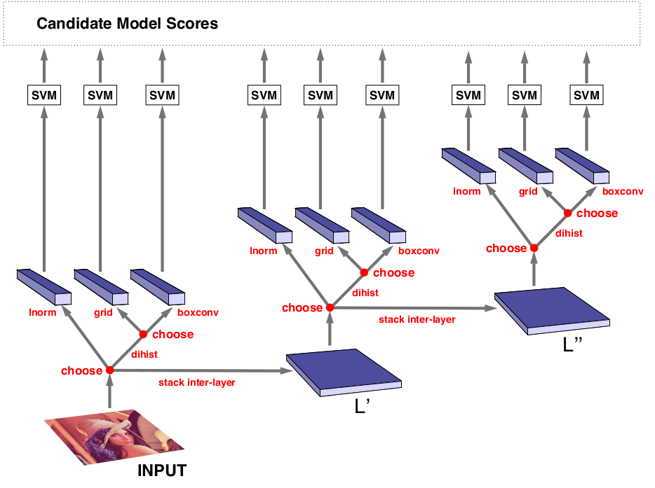

.. Automatic Parameter Optimization slides file, created by
   hieroglyph-quickstart on Tue Jul 29 13:43:01 2014.

Automatic Parameter Optimization
================================

for Professional Python group at TrueCar

August 19, 2014

ME
====

   - Senior dev/server guy; DevOps
   - 15 years experience with Python
   - john@johntellsall.com

THEME
=====

Programs have configuration where the "best" values are not
obvious.

This talk shows how to automatically and efficiently find
optimal settings under *static* and *dynamic* constraints.

.. note::

    * motivation
    * constraints
         static: hardware memory, CPU
    
         dynamic: avail memory, CPU, other procs
    
         data: send email to one addr or 1M mailing list
    
    * multiple goals
         min latency
    
         max throughput
    
         jitter
    
         min CPU/memory used
    
    * hyperopt
         example: min(x^2) over x in (-10, 10)
    
    * example: check Python files for errors in parallel
         run "pyflakes" on batch of files, N concurrently
    
         trick: use Fibonacci series to minimize convergance
    
    * example: Facebook
    
    https://code.facebook.com/posts/816473015039157/making-facebook-s-software-infrastructure-more-energy-efficient-with-autoscale/
    
    * future directions
         capture production info to optimize settings
    
         be careful: how do you debug a changing system?
    
    
       https://pypi.python.org/pypi/sphinxcontrib-blockdiag/
    

motivation: mailing list server
===============================

.. note::

   Let's say you have a bunch of servers doing stuff.  Input servers take requests and do some validation and lookup. Processing servers do the requests, like doing a mail merge of a template with 1000 names and emails.  Output processors take each email and send it to a server.

constraints
-----------

     static: hardware memory, CPU

     dynamic: avail memory, CPU, other procs

     data: send email to one addr or 1M mailing list

.. note::

   A workflow isn't a static system.

    A specific server has a set amount of CPU and RAM available via
    hardware.
    
    If there are other services running on the same server, it'll affect
    your service.
    
    Some requests might be higher CPU or memory than others -- so output
    wil depend on input.
    
    If a upstream or downstream service is running slower than normal, it
    will affect the workload.
    

optimize end-to-end performance
-------------------------------

     min latency

     max throughput

     jitter

     min CPU/memory used

.. note::

   optional preprocessing

high jitter
--------------

.. image:: _static/uneven-oreo.jpg

low jitter
------------

.. image:: _static/even-cookies.jpg

.. note::

   .. image:: _static/chickenfridaynight.jpg
   .. image:: _static/Chutes-Ladders.jpg
   .. image:: _static/kentucky-roads.jpg
   .. image:: _static/lag-tshirt.jpg
   .. image:: _static/mix-cookie.jpg

how do we satisfy constraints and get nice output?
--------------------------------------------------

   .. image:: _static/audi-cockpit.jpg

uhoh
----

   .. image:: _static/homer-buttons-dials.png

Hyperopt
=================

"hyperopt is a Python library for optimizing over awkward search spaces with real-valued, discrete, and conditional dimensions."

image classification pipeline
-----------------------------

.. note:: 

   Our experiments search a class of image classification
pipelines (c) that include 0, 1, or 2 inter-layers (a), an
outer-layer (b) that extracts features, and a support vector machine
(SVM) classifier. Inter-layers perform filter-bank normalized
cross-correlation (fbncc) and local spatial pooling
(lpool). Outer-layers are similar, but may additionally perform
quadrant pooling and local normalization (lnorm). Hyperparameters
govern the number of inter-layers, the type of outer-layer, and a host
of configuration options within each layer. Although many of the
hyperparameters are mutually exclusive (e.g. only one outer-layer is
active per pipeline) there are 238 hyperparameters in the full search
space.

min(x^2)
--------

.. raw:: html

   <iframe width="800" height="600" frameborder="0" seamless="seamless" scrolling="no" src="https://plot.ly/~johnlmitchell/1/800/600"></iframe>

.. note::

   _static/minx5e2_in_-102c_2b10.svg

.. image:: _static/minx5e2_in_-102c_2b10.png

.. include:: simple.rst

.. include:: simple2.rst

basic: check Python files for errors in parallel
================================================

pyflakes
--------

::

	pyflakes optimize.py

    optimize.py:143: local variable '_status' is assigned to but never used

.. code-block:: python

    start = time.time()
    # ignore Pyflakes warnings
    _status = subprocess.call(
        format_command(cmd_type, paths, concurrency),
        shell=True, 
        stderr=open(os.devnull,'w'),
        stdout=open(os.devnull,'w'),
    )

minimize objective function
---------------------------

.. code-block:: python

    def objective(concurrency, sample, cmd_type, outf):
        "run several jobs in parallel, return info"
        paths = random.sample(
            sample['data'], sample['batch_size'],
        )
        start = time.time()
        # ignore Pyflakes warnings
        _status = subprocess.call(
            format_command(cmd_type, paths, concurrency),
        )
        elapsed = time.time() - start
        # optimize for fastest *per-proc* time
        return dict(
            status=hyperopt.STATUS_OK,
            loss=elapsed/concurrency,
            )

from `optimize.py <http://johntellsall.com/class/auto-optimize/optimize.html>`_

run in parallel?
================

cheat!
------

.. code-block:: python

    def format_command(cmd_type, paths, concurrency):
        if cmd_type == 'pyflakes':
            return 'echo {} | xargs -n1 -P{} pyflakes 2> /dev/null'.format(
                ' '.join(paths),
                concurrency,
            )
    
`xargs <http://man.cx/?page=xargs&do%5Bgo%5D=go>`_ works wonders!

Pyflakes dataset
----------------

::

    ./optimize.py --batch=20 -o proc20.dat

    1003 source files, sampled 20 at a time
    processes: [1, 2, 3, 5, 8, 13, 20]
    CONC ELAPSED	TIME PER PROC
      20	0.78	0.039
      20	 0.8	0.04
      13	0.85	0.065
       5	0.86	0.17
       2	 1.4	0.72
       2	 1.4	0.68
       5	 1.1	0.22
       5	 1.1	0.22
       2	 1.4	0.68
      20	 1.2	0.06
    ANSWER: for files 20 at a time, do 20 jobs in parallel
    

wait, what?
===========

Pyflakes plot
-------------

.. raw:: html

   <iframe width="800" height="600" frameborder="0" seamless="seamless" scrolling="no" src="https://plot.ly/~johnlmitchell/4/800/600"></iframe>

Pylint
------

::

    $ pylint --reports=no ./optimize.py
    
    No config file found, using default configuration
    ************* Module optimize
    F: 32,0: Unable to import 'hyperopt'
    C: 33,0: Invalid name "hp" for type constant (should match (([A-Z_][A-Z0-9_]*)|(__.*__))$)
    C: 53,0:p_title: Missing docstring
    C: 57,0:p_sample: Missing docstring
    C: 63,0:write_header: Missing docstring
    C: 64,4:write_header: Operator not followed by a space
        print >>outf, '# {}'.format( json.dumps(info) )

43 lines vs 2!

Pylint more smart, and slower

Pylint dataset
--------------

::

    ./optimize.py --batch=20  -v --cmd=pylint

    1003 source files, sampled 20 at a time
    processes: [1, 2, 3, 5, 8, 13, 20]
    CONC ELAPSED	TIME PER PROC
    INFO:hyperopt.tpe:tpe_transform took 0.000967 seconds
    INFO:hyperopt.tpe:TPE using 0 trials
    INFO:hyperopt.rand:generating trials for new_ids: [0]
      20	 3.1	0.15
    INFO:hyperopt.fmin:job returned status: ok
    INFO:hyperopt.fmin:job returned loss: 0.154589855671
    INFO:hyperopt.tpe:tpe_transform took 0.001614 seconds
    INFO:hyperopt.tpe:TPE using 1/1 trials with best loss 0.154590
    INFO:hyperopt.rand:generating trials for new_ids: [1]
      20	 2.6	0.13

    
Pylint plot
-----------

.. raw:: html

   <iframe width="800" height="600" frameborder="0" seamless="seamless" scrolling="no" src="https://plot.ly/~johnlmitchell/5/800/600"></iframe>

future directions
-----------------

* production varies parameters "randomly"

* use feedback to converge

* be careful!

* use cloud for capacity planning + tradeoffs

Facebook
========

model power vs requests/sec
---------------------------

.. image:: _static/fb-cpu-plot.png

.. note::

   60 watts of power when it’s idle (0 RPS, or requests-per-second). The power consumption jumps to 130 watts when it runs at low-level CPU utilization (small RPS). But when it runs at medium-level CPU utilization, power consumption increases only slightly to 150 watts. Therefore, from a power-efficiency perspective, we should try to avoid running a server at low RPS and instead try to run at medium RPS.

power saved
-----------

☃
=

References
----------

`Distributed Asynchronous Hyperparameter Optimization in Python <http://hyperopt.github.io/hyperopt>`_

    * includes 268 hyperparameters and GPU-days!

`SciPy2013 talk <https://github.com/jaberg/hyperopt/wiki/Scipy2013>`_

`Making Facebook’s software infrastructure more energy efficient with Autoscale <https://code.facebook.com/posts/816473015039157/making-facebook-s-software-infrastructure-more-energy-efficient-with-autoscale/>`_

upcoming!
=================

* Zero to Webapp in Two Hours

* Upping your Programming Game

* Tricking out Linux Kernel Networking

Questions?
==========

