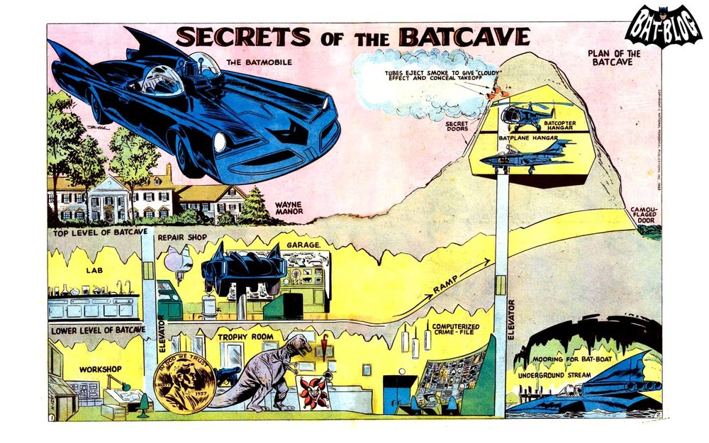
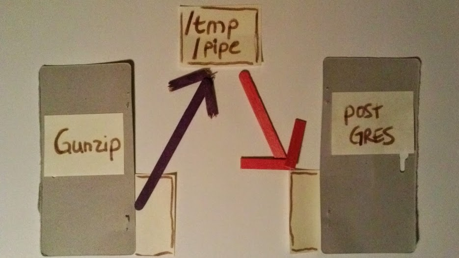
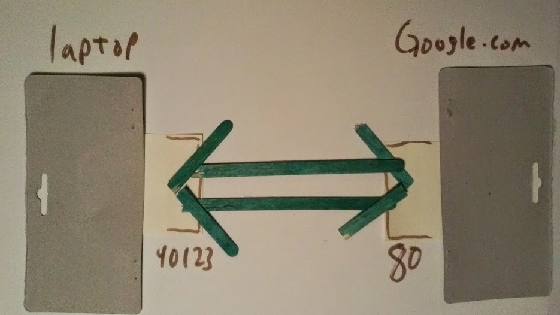
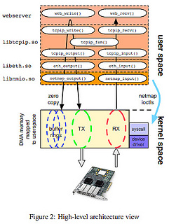

Networking Tricks with the Linux Kernel
=======================================

http://johntellsall.com/networking-tricks

**John Mitchell**

☃

next talk: Tuesday, on Django + Docker

Me
==

* Senior web/server consultant; DevOps
* 20 years experience with Python
* john@johntellsall.com

Themes
======

apps talk to other apps

.. note::

   There are tons of kernel structures to make this happen -- we'll cover about a dozen types tonight.

   Many are unknown or have subtle details. 

   It looks like it works one way, but there are important differences.
   
   and... DETAILS MATTER!

.
=

.. figure:: _static/css-is-awesome-700x375.jpg
   :class: fill

.. note::
   details matter!

choose your own tradeoffs
=========================

*How* apps talk to each other matters:

* system does work => simpler code

* *you* know your app best

.. note::

   * instead of “one size fits all” use specific features that fit your app

       => theme: concept doesn’t match implementation

this talk
=========

* overview
* tricks and awesomeness
* other directions

what is the kernel?
===================

.
=

.. note::
   * what _is_ the kernel? http://lwn.net/Articles/534682/

Q: what types of IPC are there?
===============================

Overview of Sockets
===========================

* two (or more) processes
* address for each end
* connection-oriented or connectionless

.. note::
   Everyone knows this stuff, but there’s a lot of details which can be subtle, or awesome.

   There will be a cheat sheet later

tail -f syslog | egrep ERR
===================================

good old *pipes*

* connection-oriented
* address: anonymous (or path)
* one-way reliable stream of bytes
* bytes consumed by sink

pipe
----

trick: file path = network
==========================

*named pipes* are awesome

anything with a *file address* (ie: path), can be connected to
anything that expects a file

fifo
-----

Postgres import from stream
===========================

    ``mkfifo --mode=0666 /tmp/pipe``

    ``psql -c "COPY x.x FROM '/tmp/pipe'``

    ``gunzip < data.gz > /tmp/pipe``

.. note::
   /tmp/pipe is an *address* (file path)

   JM diagram

Internet sockets
================

TCP socket
==========

   * connection-oriented
   * reliable stream of bytes
   * bytes consumed by sink
   * *new*: bidirectional
   * *new*: on each end is an “address”: IP address, a (TCP) port

HTTP(TCP)
=========

.. note::
   * address: anonymous (or path)

   Metaphor is a “pipe”: path with two endpoints -- connection oriented
   -- reliable ordered stream of bytes.

   Usage: client connects to endpoint on server, transfer data back and forth

   Example: used for web and tons of stuff.

TCP features
===============================================

* automatic flow control
* split/join packets
* *drawback:* latency

more: "Hello, would you like to hear a TCP joke?"

.. note:

   Used everywhere because it does a ton of stuff:

UDP socket
==========

* address: IP and port number
* connectionless
* fast, low latency
* multicast is awesome
* small *packets* not bytes
* *drawback:* unreliable: drops, dups, reordering

DNS
===

.. figure:: _static/cam-dns.jpg
   :class: fill

.. note:
   port NOT same as TCP ports!

   Usage: short send/receive (DNS), or fast unreliable one-way data
   like Skype, or statistics

   Example: Domain Name Service (DNS) -- send short string (hostname) to well-known UDP address, get a short response (IP number)

   Metaphor is a “postcard”: a little bit of data going from one
   street address to another. Like postcards, UDP packets can be
   received out of order or not at all, you will never know if a
   packet arrived or not. You can also get duplicate packets.

UDP: How do you know what went wrong?
=====================================

* server isn't up
* wrong IP / port
* bad router
* satellite link
* overloaded server

.. note::
   theme: details matter!

Answer
=======

.. note::

   A: no response, so you’ll never know!

   theme: best tool for the job

Detail: UDP vs TCP
==================

which is better?

.. note::
   connection oriented isn’t always the best: can’t interrupt
   data flow; CPU has to examine each and every byte to figure out
   where messages begin and end

   JM diagram

Q: how reliable is UDP?
============================

.
=

98% reliable!

Detail: UDP pseudo-connections
==============================

Q: for connectionless protocols (UDP), how does server know who to
send response to?

.. note::
   UDP: how do you know who sent you a packet?

Answer
======

A: kernel gives you user data, but there’s also other data available
in the network headers

.. note::
   server bind: s.bind((HOST, PORT))
   server: data,addr = s.recvfrom(1024)

   client send: s.sendto(msg, (host, port))
   client: reply,addr = s.recvfrom(1024)

   (JM: how?)  IP header has client’s IP.
   (JM: what about UDP port?)
   (JM: example UDP “send to client”)

Unix domain sockets
===================

* best of all worlds
* connection-oriented
* reliable stream of bytes
* bidirectional
* *new*: secure: data doesn’t travel across a network
* *new*: fast, low latency

.. note::
   * common: connection-oriented reliable stream of bytes, like TCP but same machine only
   * similar to pipe: AF: path, Linux Abstract “later”
   * like TCP: bidirectional
   * fast
   * low latency
   * can _choose_ speed vs inorder, connection vs connectionless

   later: http://www.thomasstover.com/uds.html Demystifying Unix Domain Sockets

☃
=

Cool Networking Tricks
======================

Linux-flavor AF_UNIX is awesome
===============================

fast, low-latency, reliable, and:

* byte- or packet-based!
* multicast!
* message bus!
* > 2 processes!

.. note::

   This means that if you have two or more processes on the same
   machine, you have a wide range of options, including skipping
   distributed queues like Redis Detail: and sequential packets

   * JM: expand

Extra special features
======================

* send “file descriptor” to unrelated process
* send credentials to other process

Cheat Sheet
=======================

develop in this order:

* **TCP**

* **Unix domain**

* **UDP**

* **TCP**

.. note::
    
    * reliable
    * simple
    * go through firewalls
    * adapt themselves to traffic
    * very well-understood
    * get message or error
    
    
    Okay, Two Slides
    ================
    
    use UDP packets:
    * fast
    * low latency
    * don’t have to parse messages
    * can’t get partial message
    * TCP stream you can’t interrupt
    * same machine: no dups, drops, or latency
    
    .. note::
       * good for stats
    

    Flexible
    ========
    
    UNIX-domain sockets are generally more flexible than named pipes. Some of their advantages are:
    * You can use them for more than two processes communicating (eg. a server process with potentially multiple client processes connecting);
    * They are bidirectional;
    * They support passing kernel-verified UID / GID credentials between processes;
    * They support passing file descriptors between processes;
    * They support packet and sequenced packet modes.
    
    http://stackoverflow.com/questions/9475442/unix-domain-socket-vs-named-pipes

UDP vs TCP
==========

faster?

.. note::
   we’ve talked about fast unreliable UDP and connection-oriented TCP -- what’s faster: Unix domain socket or TCP?

trick: "friend" sockets
=======================

A: for lots of connections:

"friend" TCP up to *3x* faster than Unix domain

.. note::
   http://lwn.net/Articles/511079/

.. note::

   trick: sendmsg()
   =====================

   TCP socket as stream of bytes: using sendmsg(), server can start
   workers, accept a socket, then reconnect socket to already running
   worker, then continue listening.

   => theme: details matter

   “Unlike stream sockets (tcp or unix domain), datagram sockets need
   endpoints defined for both the server AND the client. When one
   establishes a connection in stream sockets, an endpoint for the
   client is implicitly created by the operating system. Whether this
   corresponds to an ephemeral TCP/UDP port, or a temporary inode for
   the unix domain, the endpoint for the client is created for
   you. Thats why you don't normally need to issue a call to bind()
   for stream sockets in the client.”
   http://stackoverflow.com/questions/3324619/unix-domain-socket-using-datagram-communication-between-one-server-process-and

☃
=

Everything is Awesome
=====================
*future directions*

Containers
==========

.. note:

    Other classes of networks
    =========================
    
    * MAC
    * Bluetooth
    * RAW, DGRAM sockets
    

hardware ring buffer
====================

10x performance ...

... at the cost of doing everything yourself!

.. note::
   * http://highscalability.com/blog/2014/2/12/paper-network-stack-specialization-for-performance.html

   ... at the cost of 
   direct hardware ring buffer to communicate. 10x performance, at the cost of abandoning a lot of Linux services XX link

intra-cluster communication
===========================

* direct support for multiple data centers
* addr per machine not adapter
* addr 32 bit not IP
* Transparent Inter-Process Communication, or...

TIPC
----

Thanks!
=======

* **Q Carolyn**

* **Jordan**

* **Goz**

Questions?
================

.. figure:: /_static/john-bold.jpg
   :class: fill

   john@johntellsall.com

Next Talk
=========
**Docker Django stack in Five Minutes**

Tuesday!

LA Django meetup

Apache
======
.. figure:: /_static/john-bold.jpg
   :class: fill
