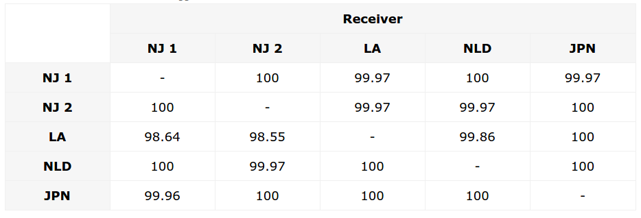

everything you know is wrong
============================

.. figure:: /_static/KKKFerrisWheel.JPG
   :class: fill

TCP Sockets:
Q: what happens if your process exits w/o closing the socket?

does socket still exist?

A: yes, as a kernel structure

Kernel gives "socket.error: [Errno 98] Address already in use"
if you try to create it again.

waiting for delinquent packets
------------------------------

.. note::

   It's waiting for delinquent packets to flow into
   previously-existing TCP socket.

* concept doesn't always match implementation 

what is a file?
	seekable collection of persistent bytes
how do you get one?
	ask kernel, get handle
what can you do with it?
	close, read/write, fctrl
"disk file": really?
	/dev/null, /proc/fd, named pipes!

=> concept doesn't match

what is a socket?
	stream of bytes, bidirectional, multi-machine
how do you get one?
	ask kernel, get handle
what can you do with it?
	close, ioctl?, send/recv
"stream of bytes": really?
	mostly; what about UDP; 

=> concept doesn't match

(default TCP settings are for file transfer, want to change settings for HTTP-ish traffic, matters if you're internet-facing vs LAN; bufferbloat)

namespaces
- socket: IP? multiple IPs? IPv6? TIPC address?
- filesystem
- in-kernel socket space!
( - cool ipfilter tricks, out of scope )

POINT:

kernel provides (file like) abstractions over *lots* of different
services, in different namespaces.

POINT:

actual implementation differs!
Ex: "stream of bytes" vs send fd to unrelated proc over X socket
Ex: tell kernel to send signal over fd(?)

*theme: everything you know is wrong*

- socket is stream, once bytes are read they're gone

LPI book: ioctl(fd, FIONREAD, &count) to get number of unread bytes in stream, or # bytes next read on datagram socket -- Linux only.

UDP reliability
=================

How reliable is sending occasional small packets acrost the
earth: 50%? 80%?

.. note::

   NJ, LA, Amsterdam, Tokyo

well...
=======

http://openmymind.net/How-Unreliable-Is-UDP/
